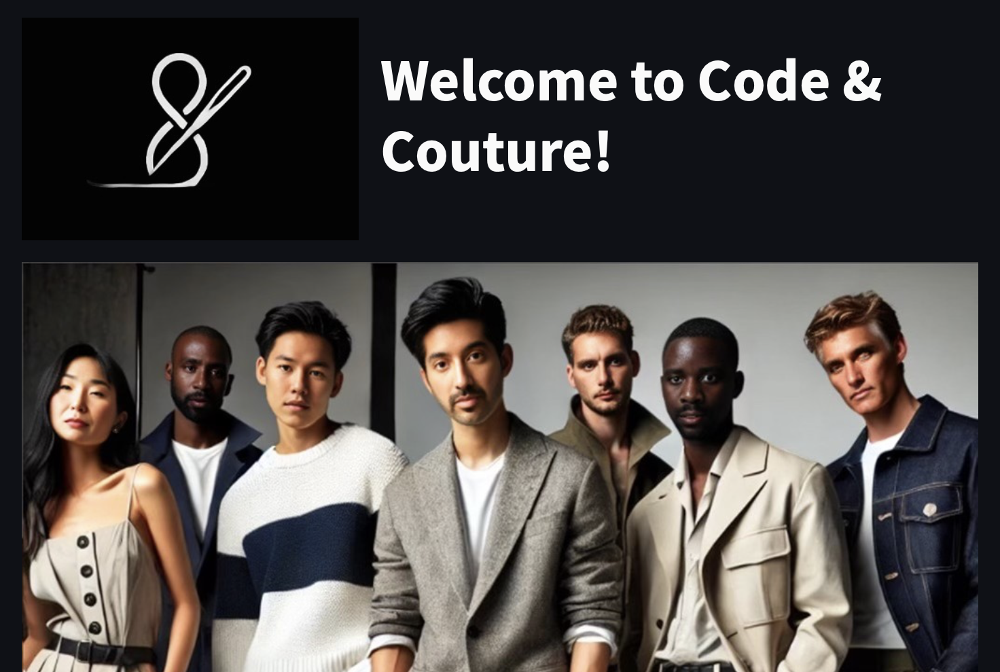

<p align="center">
  
</p>

**UNet Segmentation and Recommendation Pipeline - Project 3 group #7:**
Alan Khalili, Christine Chung, Daniyar Temirkhanov, Emmanuel Charles, Enock Mudzamiri, Grigoriy Isayev, Jaidev Kler,

# UNet Segmentation and Recommendation Pipeline

## Project Overview

This project presents a robust image segmentation pipeline utilizing a UNet model with a MobileNetV2 backbone. The solution is designed for high-performance image segmentation tasks, enabling detailed analysis and processing of visual data for applications in fashion retail and e-commerce. The pipeline integrates advanced machine learning techniques with cutting-edge APIs, providing a complete solution from model training to actionable insights and product recommendations.

### Key Features
- **High-Performance Segmentation**: Utilizes UNet architecture with MobileNetV2 for efficient and accurate segmentation suitable for real-time applications.
- **Data Augmentation**: Comprehensive data augmentation techniques are employed to enhance model robustness and generalization.
- **API Integration**: Seamless integration with Google Gemini and SerpApi for enhanced data analysis and product recommendations.
- **Scalable and Modular**: Designed to be scalable and easily customizable for various industrial applications.

## Use Cases
- **Fashion Industry**: Automatic segmentation of clothing items from images for inventory management, product categorization, and virtual try-ons.
- **E-Commerce**: Enhance product search and recommendation engines by accurately identifying and categorizing products in images.
- **Retail Analytics**: Leverage segmentation for in-store analytics such as shopper behavior analysis and shelf monitoring.

## Presentation
[Gamma.app presentation Link](https://gamma.app/docs/Code-Couture-jdwj1w5dtjnhwal)

## Project Structure

```
├── Resources
│   ├── images
│   ├── masks
│   ├── labels
│   ├── streamlit
│   ├── test_Images
├── notebooks
│   ├── clothing_segmentation.ipynb
│   ├── model_application.ipynb
├── Python scrits
│   ├── Home_Page.py
│   ├── 1_Purchase_Item_Here.py
│   ├── 2_Meet_the_Team.py
│   ├── apply_unet_model.py
│   ├── get_bounding_images.py
│   ├── gemini_image_to_text.py
│   ├── remove_stopwords.py
│   ├── search_recommendations.py
├── models
│   ├── model.h5
├── Output
│   ├── images
├── README.md
├── requirements.txt
```

- **Resources**: Contains the dataset of images and masks used for training and validation, mask labels, pictures for streamlit application and testing images.
- **notebooks**: Jupyter notebooks with code for segmentation and model application (only used for testing).
- **python scripts**:
   - **Home_page.py**: Home page for the streamlit application. 
   - **1_Purchase_Item_Here**: Steamlit application page to get user input (image, budget, brands and additional information) and provide recommendation output (images, links and pricing).
   - **2_Meet_the_Team.py**: Project team details.
   - **apply_unet_model.py**: U-Net model to create a mask of the image provided by the user.
   - **get_bounding_images.py**: Create bounding images based on the image classes.
   - **gemini_image_to_text.py**: Google Gemini API is used to covert the bounding images to text
   - **remove_stopwords.py**: Remove stopwords from additional information provided by the user
   - **serch_recommendations.py**: Google Shopping Search API is used to provide user with recommendations.
- **models**: The model used for segmentation (This is not saved in repository due to size - [Download Link](https://drive.google.com/file/d/1RPzyZ2osZtuZ8gEyUZdKx37AXMfn0Tm0/view?usp=share_link))
- **README.md**: This file, providing an overview of the project.
- **requirements.txt**: Lists all Python packages required to run the project.

## Installation

### Prerequisites

- Python 3.10+
- Streamlit
- OpenAI API Key
- SerpApi Key

### Setup

1. **Clone the repository:**
   ```sh
   git clone https://github.com/jaidevkler/Project-Clothing-Recommendation.git
   ```

2. **Create a virtual environment:**
   ```sh
   conda create -n couture python=3.10 anaconda -y
   conda activate couture
   ```

3. **Install required packages:**
   ```sh
   pip install -r requirements.txt
   ```

4. **Set up environment variables for API keys:**
   ```sh
   echo OPENAI_API_KEY="your-openai-api-key" >> .env
   echo SERPAPI_KEY="your-serpapi-key" >> .env
   ```

5. **Download and save the model:**
   - Ensure that your model is downloaded and saved in a folder named Models, which is at the same level as the Project-Clothing-Reommendation folder.

## Pipeline Components

### 1. Dataset Preparation

- **Imported images (1,000)**
- **Resized and normalized images**
- **Split images into training and testing sets**: 800 training and 200 testing.
- **Data Augmentation**: Augmented the training images to increase them to 8,800.

### 2. Model Architecture

- **Created a U-Net model with down sampling and up sampling layers**: The model is capable of identifying 59 different clothing classes.
- **Initial Model Training**: The model was fit with the training dataset, achieving an accuracy score of 0.86.
- **Model Tuning**: The model was tuned to run for an additional 100 epochs, resulting in an improved accuracy score of 0.92.

### 3. Streamlit Application - Input

- **User Interface**: Created a front-end interface for the user with a drag-and-drop feature for image uploads.
- **Mask Creation**: The uploaded image is processed using the trained U-Net model to create a mask.
- **Text Inputs**: Two text boxes are provided for the user to enter their budget and any additional information.

### 4. Get Bounding Images

- **Bounding Box Function**: Uses the masks created by the model to generate bounding boxes for each identified clothing category.
- **Cropped Images**: The function returns cropped images based on the bounding box locations.

### 5. Image to Text

- **OpenAI GPT-4o Integration**: Used to input the bounding images along with relevant questions to create a description of each bounding image.

### 6. Natural Language Toolkit

- **NLTK Integration**: Utilized the nltk library to remove stop words from the additional information provided by the user.

### 7. Google Search

- **SerpApi Integration**: Used Google SerpApi to search for products based on the image text and modified additional information.
- **Filtering**: Results are filtered based on the user’s budget.

### 8. Streamlit Application - Output

- **Recommendations**: The user is provided with recommendations for upper clothing, lower clothing, and shoes based on their inputs.
- **Detailed Output**: The user receives an image of the recommended product, a hyperlink for more details, and the price of the product.

## Running the Project

### Training the Segmentation Model

- Open the `clothing_segmentation.ipynb` notebook in Jupyter.
- Follow the instructions in the notebook to preprocess the data and train the segmentation model.
- The trained model will be saved in the `Models` directory. A download link is also provided in resources above.

### Generating Clothing Recommendations

- Run the Home_Page.py with the streamlit application:
```
streamlit run Home_Page.py
```

### Purchase Item Here

- Select the Purchase Item Here tab. 
- Drag and drop an image.
- Input preference (budget, brands and additional information)
- The application will display recommendations based on the inputs provided.

## Deployment

This pipeline can be deployed in various environments, including cloud-based platforms and on-premise servers. It is designed to handle large-scale datasets and can be integrated into existing retail and e-commerce systems.

### Suggested Deployment Steps

- **Containerization**: Use Docker to containerize the application for consistent deployment across different environments.
- **Cloud Deployment**: Deploy the containerized application on cloud platforms like AWS, GCP, or Azure for scalability and availability.
- **API Integration**: Expose the segmentation and recommendation functionalities via RESTful APIs for easy integration with other services.

## Scalability and Customization

The pipeline is built to be highly scalable and customizable:

- **Scalability**: Capable of handling large datasets and can be parallelized across multiple GPUs.
- **Customization**: Modular design allows easy integration of alternative models, datasets, and APIs based on specific industry requirements.

## License

This project is licensed under the MIT License - see the [LICENSE](LICENSE) file for details.

## Acknowledgments

- The dataset used in this project was obtained from [[kaggle](https://www.kaggle.com/datasets/rajkumarl/people-clothing-segmentation?select=labels.csv)].
- This project was developed as part of the AI Bootcamp at Columbia Engineering.


 
